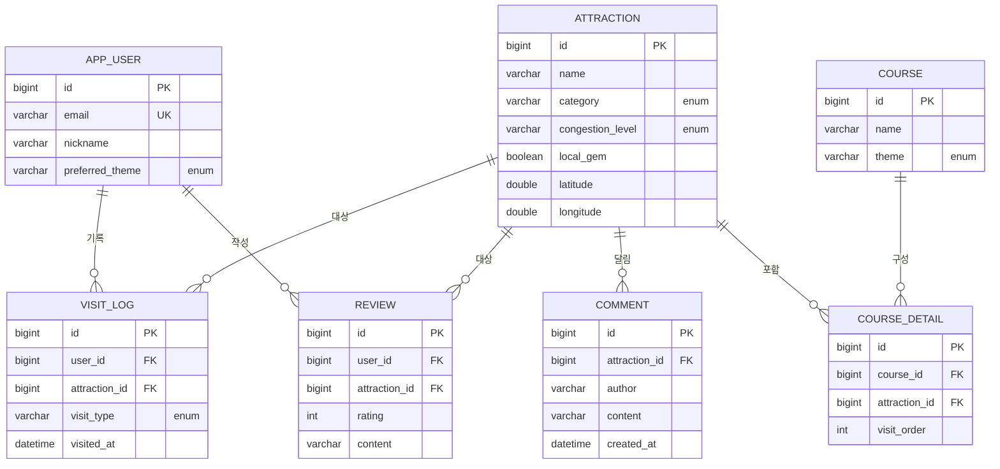

# 2. 데이터베이스 설계

## 2.1 ERD

## 2.2 테이블 명세 (요약)
| 테이블 | 주요 컬럼 | 관계 |
|---|---|---|
| `attraction` | id(PK), name, category, congestion_level, local_gem, 위경도 | 1:N → review, visit_log, course_detail |
| `app_user` | id(PK), email(UK), nickname, preferred_theme | 1:N → visit_log, review |
| `course` | id(PK), name, theme | 1:N → course_detail |
| `course_detail` | id(PK), course_id(FK), attraction_id(FK), visit_order | N:1 → course, attraction. **UNIQUE(course_id, visit_order)** |
| `visit_log` | id(PK), user_id(FK), attraction_id(FK), visit_type, visited_at | N:1 → user, attraction |
| `review` | id(PK), user_id(FK), attraction_id(FK), rating, content | N:1 → user, attraction |
| `comment` | id(PK), attraction_id(FK), author, content, created_at | N:1 → attraction (회원 FK 없음) |

## 2.3 정규화 / 무결성
- **제3정규형 준수**: 파생값(예: 사용자 보유 스탬프 수)은 저장하지 않고 `visit_log` 에서 집계 → 중복/이상 방지.
- **참조 무결성**: 모든 N:1 관계에 FK + `nullable=false`.
- **중복 방지**: `app_user.email` UNIQUE, `course_detail(course_id, visit_order)` 복합 UNIQUE,
  스탬프 중복 인증은 `visit_log` 의 `existsByUserIdAndAttractionIdAndVisitType` 로 차단.
- **다대다 해소**: Course ↔ Attraction 의 N:M 을 `course_detail` 연결 엔티티(+방문 순서)로 정규화.
- **댓글의 비회원 설계**: `comment` 은 로그인 없는 가벼운 후기를 위해 `app_user` FK 대신 `author`(닉네임 문자열)만 보관한다.
  회원·평점이 필수인 `review`(정식 평가)와 책임을 분리 — 같은 관광지에 대해 진입장벽 낮은 댓글과 신뢰도 있는 평점을 모두 수집한다.

## 2.4 열거형(enum)
- `Category`: COAST, MOUNTAIN, HISTORY, MINE_CULTURE, CAVE, OTHER
- `CongestionLevel`: LOW, MEDIUM, HIGH (분산 추천 기준)
- `TourTheme`: ECO, EXPERIENCE, HEALING, FAMILY, HISTORY_CULTURE
- `VisitType`: STAMP, ECO_ACTIVITY
